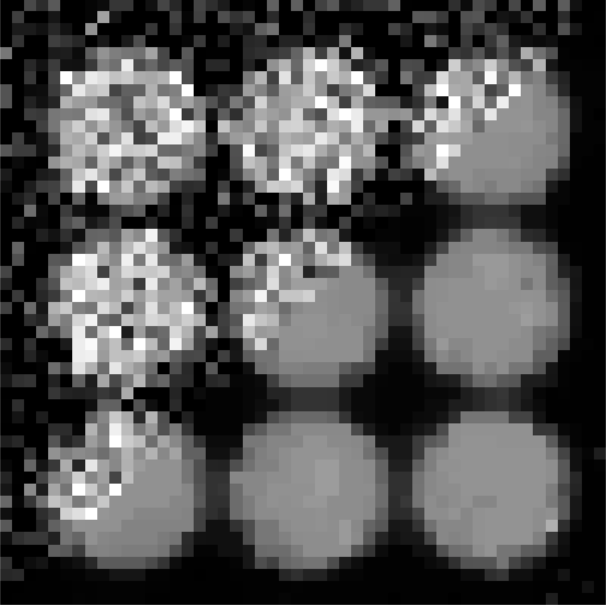

# cyTVDN
Fast multi-threaded multi-dimensional total variational denoising

[](https://zenodo.org/badge/latestdoi/248416421)



## Algorithm
This module implements an extension of the TV denoising algorithm described in [Jia and Zhao, Advances in Computational Mathematics **33**, 231-241(2010)](https://link.springer.com/article/10.1007/s10444-009-9128-5) to 3- and 4-dimensional datasets. [FISTA](https://doi.org/10.1137/080716542) acceleration is also currently implemented.

### Current Implementation Status (as of v0.1)
#### Module (OpenMP)
- [x] Anisotropic Unaccelerated 4D
- [x] Anisotropic Unaccelerated 3D
- [x] Semi-Isotropic Unaccelerated 4D
- [ ] Semi-Isotropic Unaccelerated 3D
- [x] Anisotropic FISTA 4D
- [x] Anisotropic FISTA 3D
- [x] Semi-Isotropic FISTA 4D
- [ ] Semi-Isotropic FISTA 3D

#### MPI/OpenMP
- [x] Anisotropic Unaccelerated 4D
- [x] Anisotropic Unaccelerated 3D
- [ ] Semi-Isotropic Unaccelerated 4D
- [ ] Semi-Isotropic Unaccelerated 3D
- [ ] Anisotropic FISTA 4D
- [ ] Anisotropic FISTA 3D
- [ ] Semi-Isotropic FISTA 4D
- [ ] Semi-Isotropic FISTA 3D

#### To-Do:
- [ ] Use `brew --prefix` to get correct compilers on Mac
- [ ] Advice on picking the correct &mu;

## Installation
To install, clone the git repo, navigate to the directory and run:
```bash
pip install Cython
pip install .
```

## Usage
Example usage for EELS:
```python
import cyTVDN as tv
import numpy as np
# eels_data should be a 3D numpy array, usually with
# scan axes on axes 0 and 1, and eels spetra along axis 2
mu = np.array([1, 1, 0.5], dtype=eels_data.dtype)
recon, bnorm, delta = tv.denoise3D(eels_data, mu, iterations=1_000, FISTA=True, stopping_relative_change=0.05)
```

Example usage for 4D-STEM:
```python
import cyTVDN as tv
import numpy as np
import py4DSTEM

datacube = py4DSTEM.file.io.read('/Path/To/Data.dm4')
mu = np.array([1, 1, 0.5, 0.5], dtype=datacube.data.dtype)
recon, bnorm, delta = tv.denoise4D(datacube.data, mu, iterations=100, FISTA=True, stopping_relative_change=0.05)
```

`recon` contains the denoised data, and `bnorm` tracks the total 1-norm of the accumulator arrays, and `delta` tracks the relative magnitude of the update steps (which is relevant for determining convergence). 

The parameter `mu` is a 3- or 4-element numpy array which controls the relative weighting of the raw data in the TV minimization problem. Increasing the value of mu decreases the strength of denoising along that dimension of the data. See (yet-to-be-written-paper) for details of the parameter selection process. 

## Additional Installation Notes
### MacOS
Naturally, you will need a C compiler in order for Cython to compile the module. On Macs this is somewhat complicated because the Apple-provided versions of `gcc` and `clang` do not support the `-fopenmp` option, which is used to enable multithreaded execution. To build with multithreading on a Mac you will need to use Homebrew to install `llvm`, and `libomp`. The `setup.py` script should figure out the right compiler and linker without intervention as long as they are installed in the usual Homebrew locations. 

### High-performance computing
See the example job script for NERSC Cori for how to run on HPC

When building on HPC, note that `gcc` and Cray compilers use `-fopenmp` while Intel compilers require `-qopenmp` to enable threading.

On NERSC, you must export the correct compiler as part of the `build_ext` command:

For Cray compilers:
```bash
module swap PrgEnv-intel PrgEnv-cray
CC=cc LDSHARED="cc -shared" python setup.py build_ext
```
For Intel compilers, first edit `setup.py` to replace `-fopenmp` with `-qopenmp`, then run:
```bash
module load PrgEnv-intel # or use swap if a different PrgEnv is already loaded
CC=icc LDSHARED="icc -shared" python setup.py build_ext
```
**Using the Cray compiler causes weird OpenMP behavior when combined with MPI, where all threads attempt to use the same single core! But this doesn't happen on a single node interactive job, and I don't know why. Using the Intel compiler did not have this problem.**

#### MPI
For datasets that are too large to fit in RAM on a single machine, an MPI implementation is provided. The implementation is roughly as follows:
* Divide the work across a 2D grid along the real-space axes. (*This is not necessarily the most efficient division of labor, but it makes I/O and communication easier.*)
* Each worker loads a chunk of the data, with one pixel of overlap in scan position in each direction. At the edges of the scan there is no "overlap." 
* Each worker performs an acuumulator update step using only its local hunk. *Some of the computed values at the boundaries are invalid because they do not respect the global boundary conditions of the problem.*
* The overlap regions are synchronized by inter-worker communication over MPI. The accumulators (which are backward differences) shift data "right". This fixes the boundary condition errors from the previous step.
* Each worker performs a reconstruction update step. *Again, the global boundary condition is not respected, so synchronization is needed.*
* The boundary regions of the reconstruction are propagated via MPI. The reconstruction (which uses a forward difference) shifts data "left".

> It's probably best to have one MPI worker per node, and to set OpenMP to use all (or maybe all-1 to leave some resources for async communication?) of the node's cores. I assert this on the basis that all the computations are bound by memory bandwidth, so there's probably no benefit to have more workers per node. Having more workers increases the amount of MPI communication needed, and having fewer but larger workers reduces the total communication load.

>The MPI implementation currently only allows for the J-Z boundary condition. Other BCs change what data has to be synchronized, and it gets complicated quickly. J-Z seems to work best for all data we've tested. 

### Notes

**Memory Layout** Because of the way that Cython conveys numpy arrays to C, it is required that all the numpy arrays used in the computation are C-contiguous. This is normally not a problem, as numpy arrays are created in C-contiguous mode by default. However, if you slice a numpy array, this produces a view which will usually *not* be C-contiguous. Thus, if you want to split a large TV denoising problem into chunks it will be necessary to create copies of the chunks with `datacube[chunk_x:chunk_y,:,:].copy()`, and to copy the denoised data back into the larger array, or to use `np.ascontiguousarray()`.
